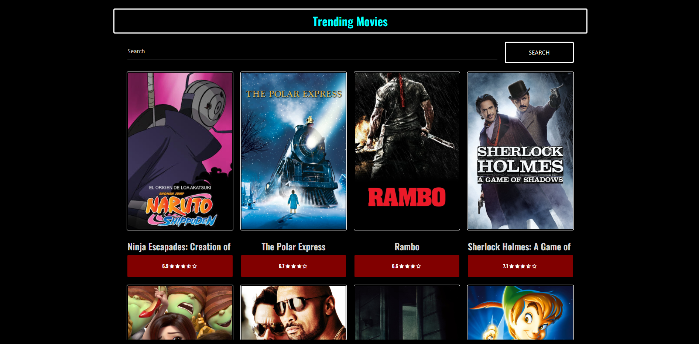

# Trending Movies

* Purpose of the app: This app was created to show a user friendly application on the movies that are being most watched currently, you can even search for a movie to see what rating it has gotten by other users 

* Features on the app: The app has a search feature to search for any movie and also to see the ratings of the movie. Has a feature where you hover the movie and it will show you the description of the movie. You can also type what genre you are looking for in the search bar and find movies that way.

## Preview Example

## Api
[MoviesDB] (https://www.themoviedb.org/?language=en-US)

## Link Example
[TrendingMovies] (https://trendingmoviesja.surge.sh/)

## Programming Languages
* HTML, CSS, JavaScript.

## Contributors
* Nova Merida
* Daniel Moros

